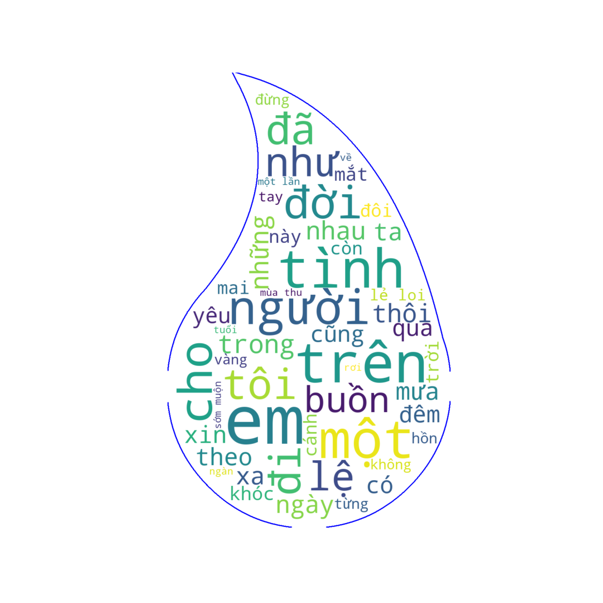

> In a cold rainy afternoon at work, I ran into the `Giọt Lệ Cho Ngàn Sau (A tear for eternity) - Tình Khúc Từ Công Phụng` album by `Tuấn Ngọc`. By Tuan Ngoc's warm voice, the lyrics of Tu Cong Phung's songs were so beautiful that I decided to "take a break" to generate a word cloud from them.

**Append a space to all lyrics files**  
`$ echo " " | tee -a ./lyrics/*.txt`

**Merge all lyrics files into a single file**  
`$ cat ./lyrics/* > lyrics.txt`

**Upload lyrics.txt and tear.png to [Google colab and run the notebook](https://colab.research.google.com/drive/1FKqkHI8q8GlqHlPtnHBVCEVmZOKAuYJv) to generate the word cloud**

  

